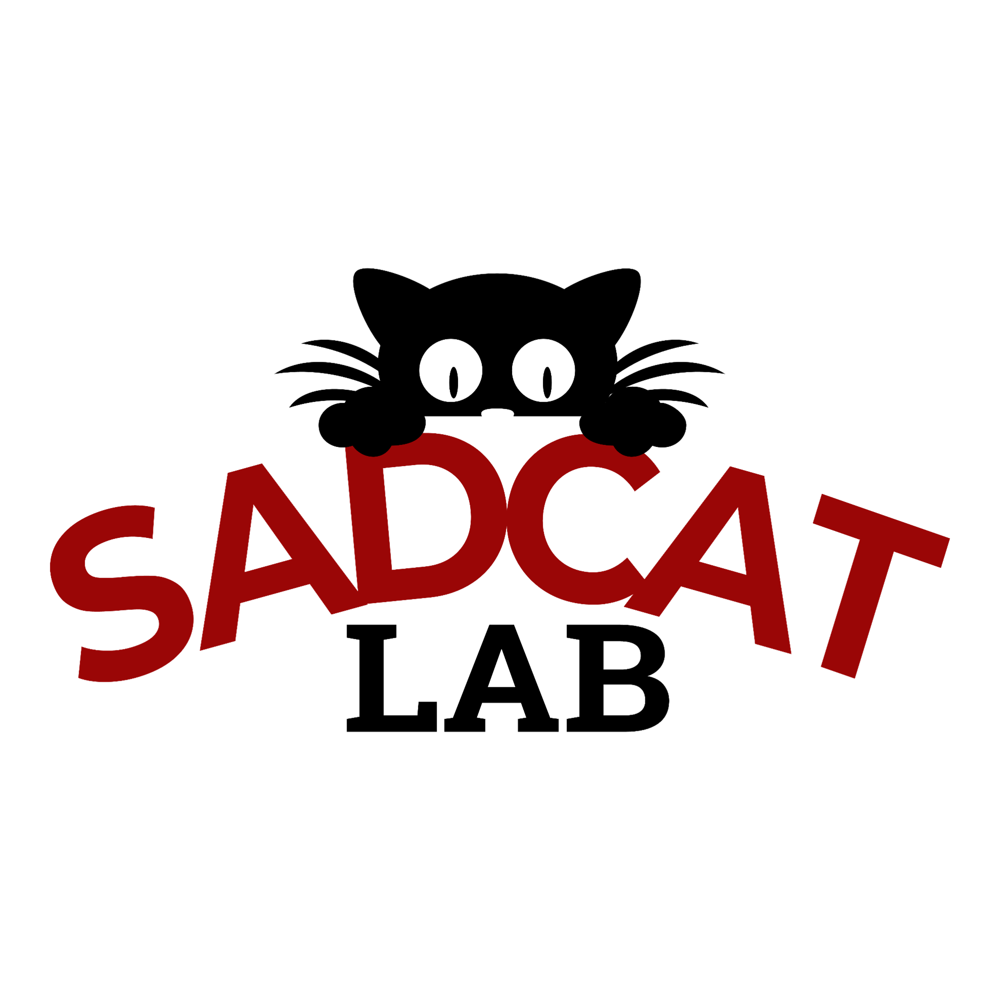

<h1 style="color:#990000">**What is this website about?**</h1>

 
This is a *work in progress* as the website for Prof. Lorenzo-Luaces lab, the Study of Affective Disorders' Classification and Treatment (SADCAT) Lab.  The SADCAT Lab is currently housed at Indiana University - Bloomington in the Department of Psychological and Brain Sciences. We are learning how to render websites using R Markdown so we appreciate this site may not *look* pretty (yet). That said, we're excited about the ability to share our work and our vision for psychological and brain sciences with you!

{height=450px width=450px}

