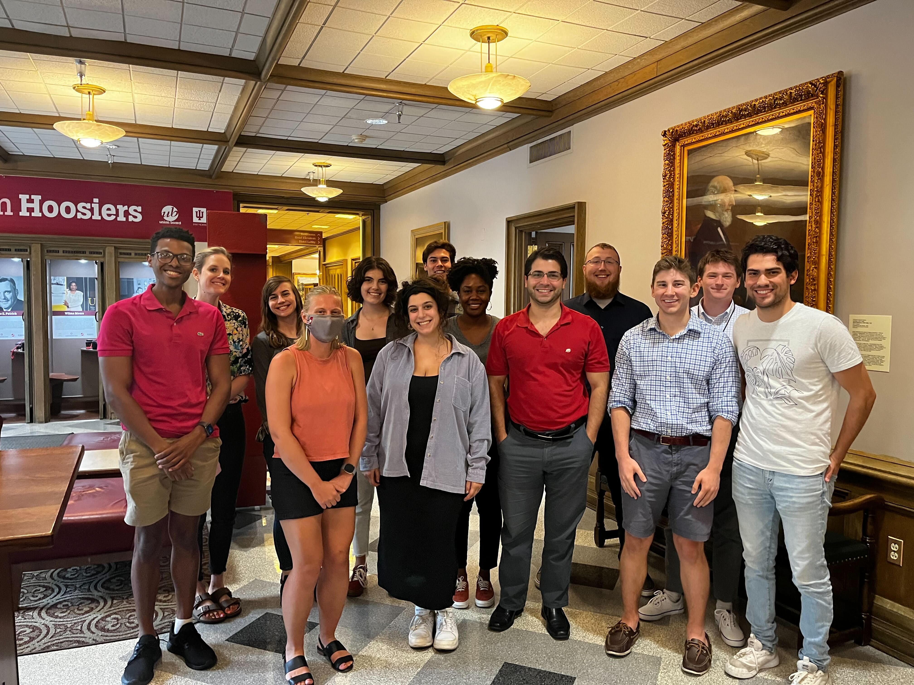

<h1 style="color:#990000">**What is this website about?**</h1>

 

<h3>

This is a *work in progress* as the website for Prof. Lorenzo-Luaces' lab, the Study of Affective Disorders' Classification and Treatment (SADCAT) Lab.  The SADCAT Lab is currently housed at Indiana University - Bloomington in the Department of Psychological and Brain Sciences. We're excited to share our work and our vision for psychological and brain sciences with you!

</h3>

  

{height=450px width=450px}

{height=450px width=550px}

 

