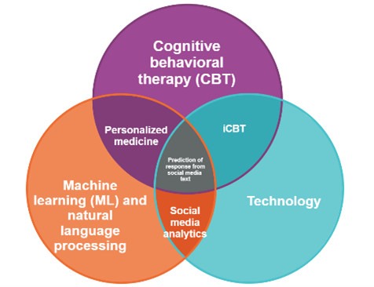

<h1 style="color:#990000">**What is this website about?**</h1>

 

<h3>

This is a *work in progress* as the website for Prof. Lorenzo-Luaces' [**lab**](https://psych.indiana.edu/directory/faculty/lorenzo-luaces-lorenzo.html), the Study of Affective Disorders' Classification and Treatment (SADCAT) Lab.  The SADCAT Lab is currently housed at [**Indiana University - Bloomington**](https://www.indiana.edu/) in the [**Department of Psychological and Brain Sciences**](https://psych.indiana.edu/). We study internalizing symptoms like depression and anxiety with a focus on cognitive-behavioral therapies (CBTs), the role of technology in mental health and its treatment, and the application of data science methods to clinical psychology. We're excited to share our work and our vision for psychological and brain sciences with you!

</h3>

  

{height=450px width=450px}

{height=300px width=350px}

 

{height=300px width=400px}

